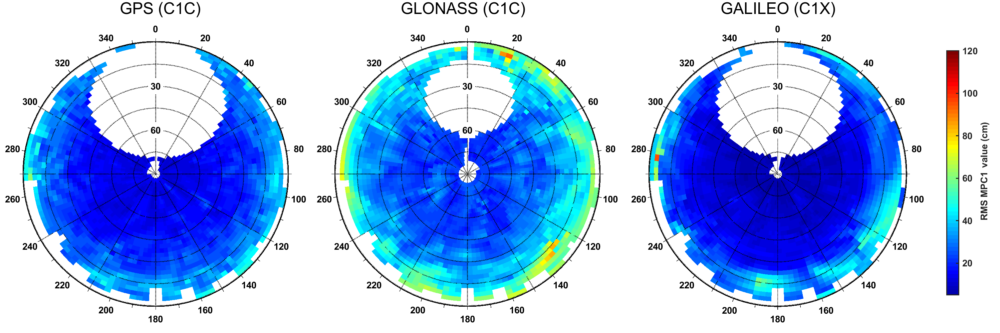
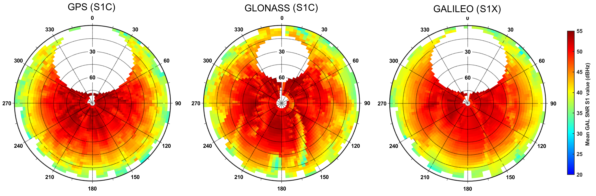
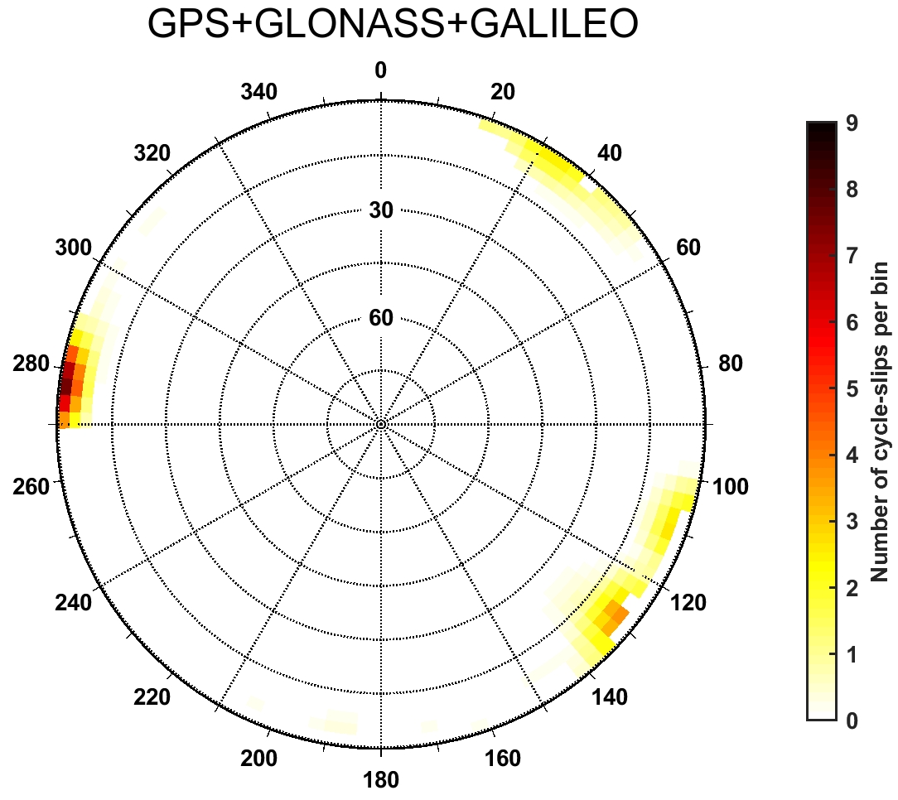

## xtr-utils

MATLAB functions to create polar skyplots for [Gnut-Anubis](http://www.pecny.cz/GOP/index.php/gnss/sw/anubis) XTR output files for MP variable, SNR and cycle-slips. For polar plots [polarplot3d](https://www.mathworks.com/matlabcentral/fileexchange/13200-3d-polar-plot) function from Ken Garrard is used (included in repo).

#### Description 

* `xtr2MPskyplot` create skyplot of MP combination for all available GNSS from XTR file
* `xtr2SNRskyplot` create skyplot of SNR quantity for all available GNSS from XTR file
* `xtr2CSskyplot` plots skyplot of cycle-slip density (simple kernel density) for all GNSS together
* `getDefaultXTRoptions.m` returns default plotting and saving properties for MP, SNR or CS plots

#### Usage 
```matlab
% Add content of lib to path
addpath(genpath('GNSS-toolbox/src')) 
% addpath(genpath(xtr-utils)) % If only XTR function should be added

% Function's calls
xtr2MPskyplot('example/xtr-utils/GANP.xtr','C1C') % To get plot also for GAL use 'C1X' 
xtr2SNRskyplot('example/xtr-utils/GANP.xtr','S1C') % To get plot also for GAL use 'S1X' 
xtr2CSskyplot('example/xtr-utils/GANP.xtr')

% Use specific options
opt = getDefaultXTRoptions('SNR');
opt.figSavePath = pwd();
opt.colorBarLimits = [15,40];
saveFigFlag = true;
xtr2SNRskyplot('example/xtr-utils/GANP.xtr','S2W',saveFigFlag,opt)
```

#### Examples

* MP combination skyplots
<p align="center">
  
</p>

* SNR quantity plot

<p align="center">
  
</p>

* Cycle-slips density skyplot

